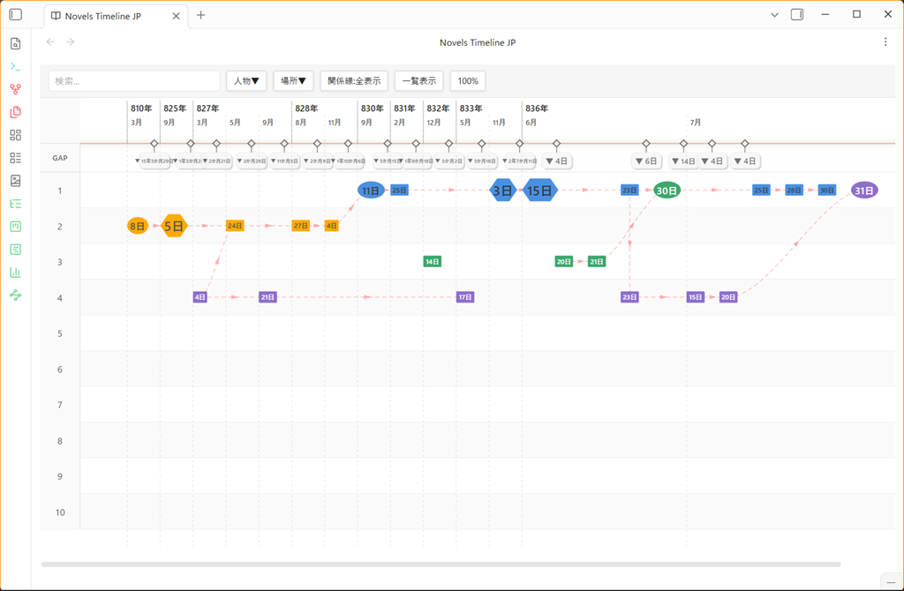

# Novels Timeline JP

小説の出来事（イベント）を時系列で可視化し、物語構造を俯瞰するための Obsidian プラグインです。

登場人物や場所の管理、執筆支援機能は持ちません。「何が」「いつ」「どこで」「誰によって」起きたかを時間軸上に配置し、物語全体の流れと関係性を見渡すことに特化しています。



---

## 特徴

- **Markdownファースト** — イベントデータの実体は各ノートのフロントマターであり、独自データベースは持ちません。キャッシュ（`timeline-cache.json`）はあくまで補助的なものです。
- **1ファイル = 1イベント** — 1つのMarkdownノートが1つの物語上の出来事に対応します。
- **独自暦対応** — 西暦12か月に限らず、月数・各月の日数・月名を自由に定義したオリジナルの暦（例:「帝国暦」など）で日付を管理できます。
- **縦軸タイムライン** — 縦方向が時間の流れ（上＝過去／下＝未来）で、左から「年」「月」「GAP」「レーン1〜N」の列が並びます。時間軸は左寄せで固定表示されます。
- **レーン配置** — イベントは1〜設定値（既定10、最大20）のレーン列に配置され、同時期に並行する複数の出来事を横に並べて表示できます。同じ日・同じレーンで重なった場合のみ、隣接する空きレーンへ自動的にずらして表示されます（保存されるレーン値そのものは変更されません）。
- **時間圧縮（Gap）表示** — イベントが存在しない期間を「3年」「2か月」のように圧縮表示し、クリックで展開/再圧縮できます。
- **関係線** — イベント同士のつながりをベジェ曲線で可視化します（選択時のみ／常時／非表示を切替可能）。`wikilink` 形式で情報を保存しているため、Obsidianのグラフビューやバックリンクにも反映されます。
- **ノード間日数計測** — 右クリックメニューから2つのノードを順に選択し、独自暦に基づく日数差をモーダルで確認できます。
- **検索・フィルタ** — タイトル・概要のあいまい検索（Fuse.js）、登場人物・場所によるフィルタ（カテゴリ内OR・カテゴリ間AND）に対応します。
- **一覧表示（テーブルビュー）** — タイムライン表示と切り替えて、全イベントを表形式で確認できます。行内の登場人物・場所タグをクリックするとフィルタへ反映され、関連イベントタグをクリックすると該当行までスクロールします。
- **配色セット** — ノードの色（ノード色・文字色）を「配色セット」として一括管理し、あとからまとめて変更できます。配色セット未使用の古いノートに残る生のHEXカラーコードもそのまま解釈されます。

---

## データの持ち方

### イベントノート

イベント情報は各ノートのフロントマターに `NTJP_` プレフィックス付きキーとして保存します。書き込みは Obsidian 標準の `processFrontMatter()` を使用するため、他プラグインが利用するフロントマターキーと共存できます。

```yaml
---
NTJP_event_title: 旧館探索
NTJP_date: 1345/5/12
NTJP_lane: 3
NTJP_node: medium
NTJP_colors: default-blue
NTJP_characters:
  - 美鈴
  - 健吾
NTJP_locations:
  - 旧館
  - 地下室
NTJP_summary: 地下室への侵入調査
NTJP_links:
  - "[[0003-地下室発見]]"
---
```

| キー | 必須 | 内容 |
|---|---|---|
| `NTJP_event_title` | 任意 | 表示タイトル。未設定の場合はファイル名から番号部分を除いたものを使用（旧ノートとの互換用） |
| `NTJP_date` | 必須 | 日付文字列。`年月日` 区切り（例: `1345年5月12日`）、`YYYY-M-D` / `YYYY/M/D` / `YYYY.M.D`、スペース区切り（`YYYY M D`）に対応し、先頭に暦名などの任意の文字列プレフィックス（例: `帝国暦`）を付けられる |
| `NTJP_lane` | 必須 | レーン番号（1〜設定値。既定は1〜10、最大20まで拡張可能） |
| `NTJP_node` | 必須 | ノードサイズ（`small` / `medium` / `big`） |
| `NTJP_colors` | 必須 | 配色セットのID、または後方互換用の生HEXカラーコード |
| `NTJP_characters` | 任意 | 登場人物一覧 |
| `NTJP_locations` | 任意 | 場所一覧 |
| `NTJP_summary` | 任意 | 概要（複数行はノート内部で `_LineBreak_` トークンに変換して保存し、表示時に改行へ復元） |
| `NTJP_links` | 任意 | 関連イベントへのWikilink一覧 |

- ファイルはイベント番号を含む `0001-旧館探索.md` の形式で命名されます。番号はファイル名の一意性確保のためだけに使われ、フロントマターには保存されません（イベント番号とフロントマターの二重管理を避けるため）。
- 各ノートの `NTJP_date` の有無によって「イベントファイルかどうか」を判定します（探索は `metadataCache` 経由で行われ、YAMLの生パースは行いません）。
- 日付から一意に定まる内部的な時系列値（`timelineOrder`）を算出し、描画・並び替え・Gap計算・日数計測などすべての基準として使います。この値はMarkdownには保存されません。

### キャッシュ・配色セットファイル

プラグイン専用フォルダ（`.obsidian/plugins/novels-timeline-jp/`）に以下を保存します。

- `timeline-cache.json` — 時系列値のキャッシュ（削除・再構築可能）
- `color-presets.json` — 配色セット一覧（初回起動時に既定6色を自動生成）

---

## 画面構成

### メインビュー（タイムライン）

- 左から「年」「月」「GAP」「レーン1〜N」の列で構成され、年・月・GAP列は左側に、ヘッダー行は上部に固定表示されます。
- ノードをクリックすると右サイドバーに詳細・編集フォームが開きます。
- ノードはドラッグ&ドロップでレーンを左右に移動でき、移動結果はフロントマターの `NTJP_lane` に自動保存されます。
- 空白部分を右クリックすると以下のコンテキストメニューが開きます。
  - **新規イベントを作成** — クリックした位置の日付・レーンを引き継いで右サイドバーに作成フォームを開く
  - **ノード間日数計測** — 始点・終点の2ノードを順にクリックし、日数差を独自暦換算でモーダル表示
  - **Gapをすべて展開／折りたたむ**（Gapが存在する場合のみ）
- ツールバーには検索ボックス、人物フィルタ、場所フィルタ、関係線表示モード切替（選択時のみ／全表示／非表示の3段階トグル）、一覧表示⇄タイムライン表示の切替、ボードズーム（クリックでスライダーパネル表示、タイムライン上でShift+ホイールでも変更可）があります。
- ノードへのホバーでツールチップ（タイトル・日付・登場人物・場所・概要を表示。登場人物・場所は先頭1件のみ表示し残りは「…他」と表示）が表示されます。

### 右サイドバー（イベント作成・編集）

- 新規作成フォーム：タイトル・日付・レーン・サイズ・配色セット・登場人物・場所・概要・関連イベント・保存先フォルダ（既存フォルダの入力補完つき）を入力してノートを新規作成します。
- 既存イベント表示時は「イベントノートを開く」ボタンからノート本体をメインペインの新規タブで開けます。保存・削除もサイドバーから行えます。
- タイトル変更時はファイル名も追従して自動リネームされます（番号プレフィックスは維持）。
- サイドバー単体でも動作するよう、イベント一覧の取得は `TimelineView` に依存せず `vault` / `metadataCache` から直接読み取ります。

### 一覧表示（テーブルビュー）

タイトル・日付・登場人物・場所・概要・関連イベントを表形式で一覧表示します。タイトルをクリックするとノートを開き、登場人物・場所タグをクリックするとその値でフィルタが絞り込まれ、関連イベントタグをクリックすると該当行までスムーズスクロールしてハイライト表示されます。

---

## 設定項目

設定タブから以下を変更できます（Obsidian 1.13.0以降の宣言型設定APIに準拠しているため、Obsidianの設定検索からも見つけられます）。

**General**（見出しなしの先頭セクション）
- 新規イベントの保存先フォルダ
- Excluded folders（検索から除外するフォルダ、カンマ区切りで複数指定可）

**Display**
- Board zoom（タイムラインボード全体の拡大率、50〜200%）
- 配色セットの管理（追加・編集・削除）

**Relation（関係線）**
- 色・線種（実線／破線／点線）・太さ（1〜6px）・矢印形状（なし／矢印／三角）・透明度・ベジェ曲率

**Timeline**
- Lane count（レーン列数、1〜20、既定10）
- Gap compression のON/OFF
- Gap threshold（Gap生成条件の日数、3〜30日、既定30日。3日未満は重なり防止のため常にGap化されません）

**Calendar（暦設定）**
- 暦の名前、月ごとの日数・月名を自由に定義（月の追加、デフォルト暦（西暦12か月）への復元も可能）

**Advanced**
- Virtual rendering のON/OFF、Render buffer（先読み描画範囲、px）
- Rebuild cache（キャッシュの再構築ボタン）

---

## 主要な内部アルゴリズム

### 時系列値（timelineOrder）の算出

暦設定（`CalendarSettings`）の月ごとの日数をもとに、以下の式で一意な整数値を算出します。

```
timelineOrder = (年 - 1) × 1年の総日数
              + 該当月より前の月の累積日数
              + (日 - 1)
```

この値がソート順・レイアウトY座標・Gap計算・日数計測すべての基準になります。日付文字列自体は暦プレフィックス付きの自由記述を許容しつつ、内部的には常にこの整数値で一貫した順序を保証します。

### レイアウト

- 縦方向（Y座標）は日付ごとに1行を割り当てて算出し、同日のイベントは同じY座標に配置されます。ノードサイズ（small/medium/big）に応じて必要な余白も考慮されます。
- 横方向（X座標）はレーン番号（1〜laneCount）で決まる固定列です。同じ日・同じレーンにイベントが重なる場合のみ、空いている隣接レーンへ自動的にずらして重なりを回避します（`NTJP_lane` の値そのものは変更しません）。
- 時間軸（縦線）は年列と月列の境界に固定表示され、レーン列はその右側に並びます。

### Gap（時間圧縮）

隣接イベント間の日数が設定した閾値（既定30日、最小3日）以上のときにGapを生成し、「○年○か月○日」の形式でラベル表示します。展開状態はGapごとに記憶され、クリックで個別に展開/圧縮できます。

---

## 動作環境

- Obsidian Desktop 専用（モバイル非対応）
- `minAppVersion`: 1.13.0

## ライセンス

MIT License
